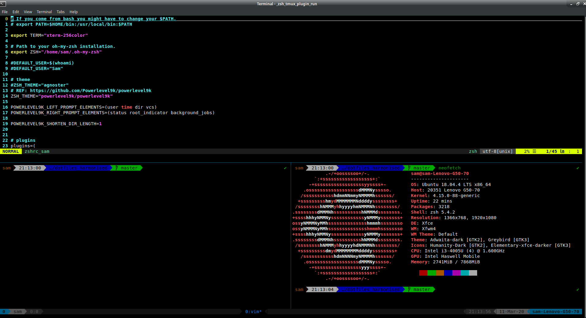

# dotfiles_harmonised

## My dotfiles
 * If you are reading this, then I probably wouldn't bother or waste your time. This is just a store for the various configuration files that I use, across the machines that I work on.
 * That being said, if you wish to steal anything, (as I undoubtedly have), then please be my guest!
* zsh + [oh-my-zsh](https://github.com/ohmyzsh/ohmyzsh)
* bash dotfiles for legacy purposes only

