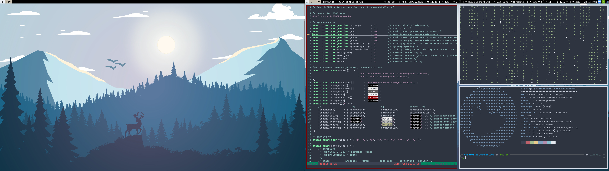

# dotfiles

[](https://gitlab.com/sdysch/dotfiles/-/commits/master)
[](https://www.codefactor.io/repository/github/sdysch/dotfiles)

## My dotfiles
 * If you are reading this, then I probably wouldn't bother or waste your time. This is just a store for the various configuration files that I use, across the machines that I work on.
 * That being said, if you wish to steal anything, (as I undoubtedly have), then please be my guest!



## Setup
* OS: [xubuntu](https://xubuntu.org/) 20.04 (xfce)
	* Trouble setting up wireless drivers. See https://askubuntu.com/questions/1218141/dell-vostro-5490-no-wifi-in-ubuntu-18-04
	* Script in .local/bin/restorewifi to fix
* Window manager: [dwm](https://github.com/sdysch/dwm)
* zsh (bash on lxplus)
* (neo)vim + [Vundle](https://github.com/VundleVim/Vundle.vim)
* My [custom dmenu build](https://github.com/sdysch/dmenu)

## Installation
* Some installation instructions can be found [here](docs/install.md), but they may be out of date
* Clone repo to `~/dotfiles`, then follow system specific instructions below
 
### Home
* Installation with gnu stow
* For home, clone repo to `~/dotfiles` then:
```
cd ~/dotfiles
source install_scripts/install_packages.sh
stow --no-folding home
```

### mac
* Installation with gnu stow
```
# Install homebrew
/bin/bash -c "$(curl -fsSL https://raw.githubusercontent.com/Homebrew/install/HEAD/install.sh)"
cd ~/dotfiles
cat packages/cask.txt packages/leaves.txt | xargs brew install
stow --no-folding mac
```

### lxplus
* Clone repo to `~/dotfiles`, then:
```
cd ~/dotfiles
source install_scripts/install_lxplus.sh
```

### Manchester
* Clone repo to `~/dotfiles`, then:
```
cd ~/dotfiles
source install_scripts/install_manchester.sh
```

For Manchester, to do anything useful with git, be sure to do
```
setupATLAS
lsetup git
```
on a machine with cvmfs available. The default git version (1.7.1) is _way_ too old....

* Mirror [here](https://github.com/sdysch/dotfiles)
